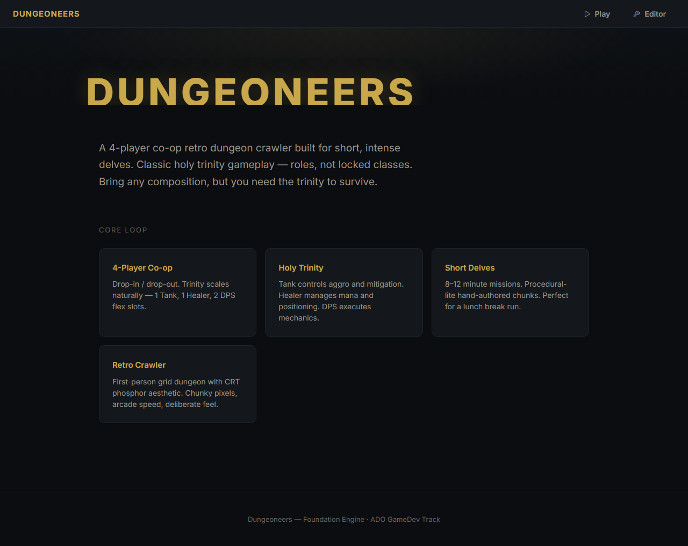
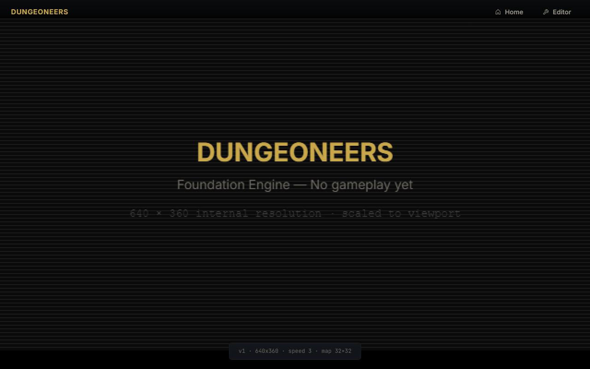
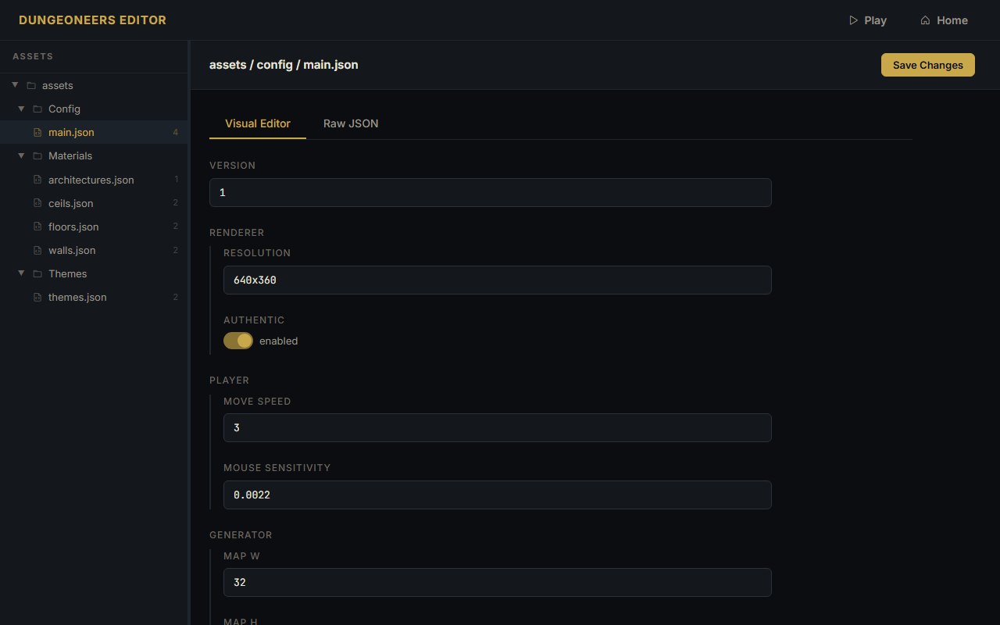

# Task: foundation-engine

## Description

Foundational engine setup for Dungeoneers — establishing a lightweight custom engine layer rather than relying on off-the-shelf game frameworks. Dungeoneers uses bespoke rendering techniques and a fully data-driven asset pipeline where all game content lives as editable JSON, so a minimal custom scaffolding provides the control needed over rendering, asset formats, and live editor workflow from day one.

This task delivers a Node.js server with unified asset REST API persisting JSON to disk, a landing page introducing the game, a fullscreen game runtime placeholder with canvas rendering, a live asset editor with dual-mode editing (visual widgets + raw JSON) and collapsible folder tree navigation, a cohesive design system with Phosphor Icons shared across all pages, and Playwright end-to-end test coverage. No gameplay logic yet — this is the lightweight editor/engine foundation upon which dungeon generation, custom WebGL rendering, entities, and RPG systems build incrementally in subsequent tasks.

See [instruction.md](./instruction.md) for the full specification used to build this feature.

## Implementation Summary

Built manually following the instruction.md specification. Key components implemented:

- **Server** (`src/server/server.js`): Node.js HTTP server with unified asset REST API (config as asset under `assets/config/`), static file serving, graceful shutdown
- **Landing page** (`src/index.html`): Elegant hero with radial gradient and scanline texture, feature cards grid, cohesive dark theme design system with CSS variables
- **Game page** (`src/game.html` + `src/main.js`): Fullscreen black viewport, canvas scaled to fit window preserving 640x360 internal res, fixed top bar, bottom HUD pill with backdrop blur
- **Editor page** (`src/editor.html` + `src/editor.js`): Three-panel layout with sidebar asset navigation, dual-mode editor tabs (Visual widgets default, Raw JSON secondary), generic form renderer
- **Unified asset API client** (`src/config/config.js`): Minimal API — getConfig/saveConfig, getAsset/saveAsset/getAssetList. No export/import/reset — git handles versioning.
- **JSON assets (unified)**: config/main.json plus walls, floors, ceils, architectures, themes — all under src/assets/
- **Test suites**: 7 Node.js unit tests covering server asset handling (path traversal defense, input validation, dynamic discovery, persistence formatting) plus 14 Playwright E2E tests covering full-stack integration across all three pages — 21 total passing

## How to verify

**Prerequisites:** Node.js v18+ installed. Modern browser with ES module support.

**Install and start:**
```bash
cd src
npm install              # installs @playwright/test dev dependency
npx playwright install   # downloads browser binaries (first time only)
npm start                # starts Node.js server at http://localhost:8000
```

**Open in browser:**
- Landing: http://localhost:8000/ — hero section with "Play Game" and "Open Editor" buttons, navigation bar with Phosphor icons
- Game: http://localhost:8000/game.html — fullscreen black canvas scaled to viewport, top bar navigation, bottom HUD pill showing config values fetched from API
- Editor: http://localhost:8000/editor.html — three-panel layout with collapsible folder tree sidebar, dual-mode tabs (Visual default / Raw JSON), Save Changes button

**Run tests:**
```bash
cd src
npm test                 # runs unit tests (7) then E2E tests (14) — all 21 should pass
npm run test:unit        # Node.js unit tests only — fast, no browser needed
npm run test:e2e         # Playwright E2E only
npm run test:ui          # E2E UI mode for debugging
npx playwright show-report  # view HTML report after E2E run
```

**Expected behavior:**
- Server logs startup confirmation with port number and API requests (method, path, status)
- All three pages load without console errors
- Editor sidebar dynamically reflects `src/assets/` folder structure — no hardcoded categories
- Saving in editor PUTs to `/api/assets/{category}/{name}` and persists JSON to disk with 2-space indentation
- Game page fetches config from `/api/assets/config/main` and displays values in HUD

## Avocado vs Claude Performance

TBD — task not yet implemented via model one-shot. Once golden feature is built, one-shot the instruction.md with BOTH Avocado (1P) and Claude (3P) separately and record findings here. Do NOT commit any code from these one-shots — this section is for researchers to compare model capabilities.

| Evaluation | Claude | Avocado | Track opportunity |
| --- | --- | --- | --- |
| TBD | TBD | TBD | TBD |

## Human-Tuned Areas

- **Unified asset architecture**: Config eliminated as separate concept — now an asset like any other, simplifying API and client code
- **Config schema**: Minimal version 1 schema with renderer/player/generator sections; version field for future migration
- **Design system & dual-mode editor**: CSS variables, Inter + JetBrains Mono typography. Visual tab auto-generates widgets per type (number+slider, toggle, color picker, expandable arrays). Raw JSON tab with bidirectional sync.
- **Test strategy**: E2E tests validate full stack integration (server start → page load → API roundtrip → persistence); avoided brittle network timing assertions by waiting for DOM content instead of network events
- **Bash heredoc escaping**: Fixed template literal expansion issues in generated JS files by switching to string concatenation for dynamic paths

## Screenshots


*Elegant landing with hero gradient, large gold typography, feature cards grid, refined CTAs.*


*Fullscreen game canvas scaled to viewport with minimal top bar and bottom HUD pill.*


*Editor with three-panel layout — collapsible folder tree sidebar, dual-mode tabs (Visual widgets + Raw JSON), and Save Changes button. Generic form renderer maps JSON types to appropriate widgets with bidirectional tab sync.*

Screenshots referenced from [task.toml](./task.toml).

## Videos

Do not commit video files. Upload to **PixelCloud** and reference links here and in task.toml (`videos`, `teaser` — teaser is ~10 sec highlight).

- Gameplay: TBD
- Teaser: TBD

## Trajectories

Built manually following instruction.md — no model trajectory to record.

- Gold build trajectory: N/A (manual implementation)

## Tag reference

`task.toml` uses controlled vocabularies. Pick from these lists:

**game-tags:** Arcade/action · Puzzle/board/card · Simulation/management · RPG/adventure/story · Sports/racing/vehicle · Casual/avatar/decor · Educational/serious · 3D/VR scene-like · Interactive scene/cinematic · Other game/unclear

**tech-stack-tags:** Web JS/DOM · Vanilla JS canvas · React/TS canvas · Three.js/WebGL · Phaser 3 · Pixi.js · Godot · Unity/Roblox/native game engine · Unspecified/other
*Note: Dungeoneers uses vanilla-js, nodejs, html5, rest-api, playwright — some map to controlled vocab, some are descriptive extensions.*

**assets-used:** Primitives · ImportedAssets
*Note: Dungeoneers uses primitives and procedural — both fit controlled vocab as descriptive extensions.*
