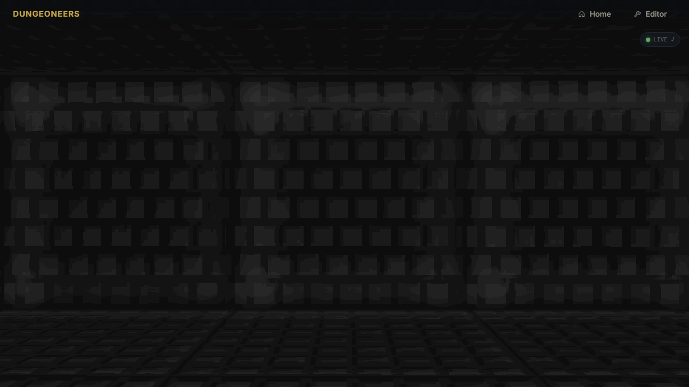
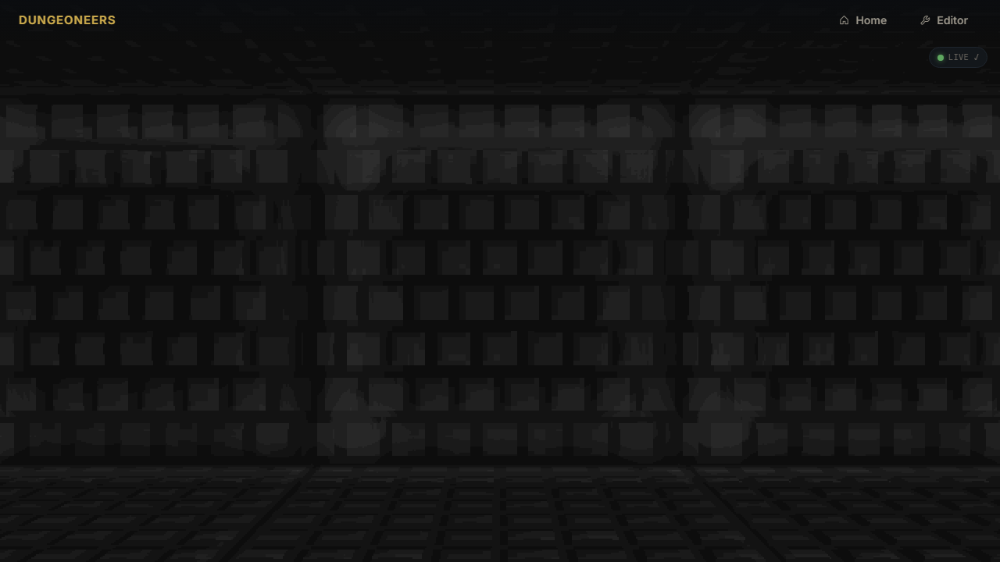
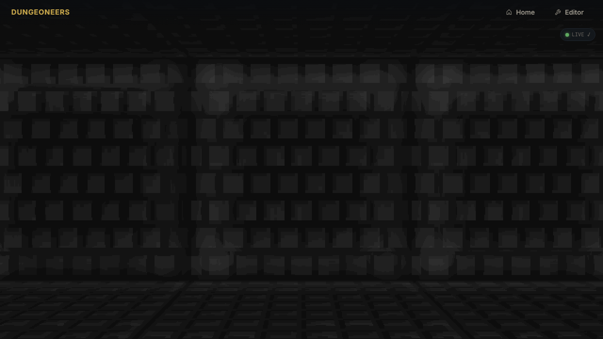
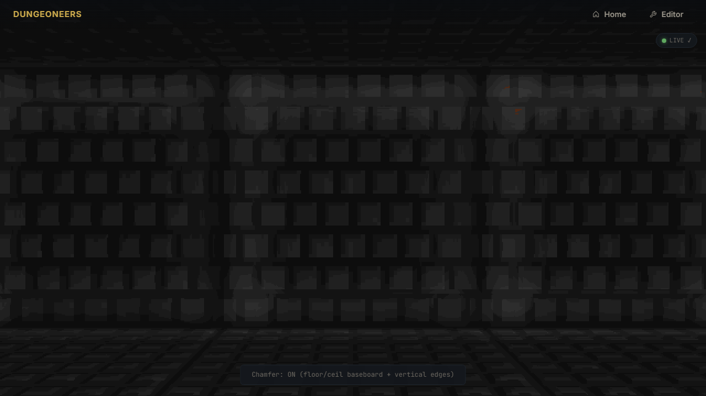
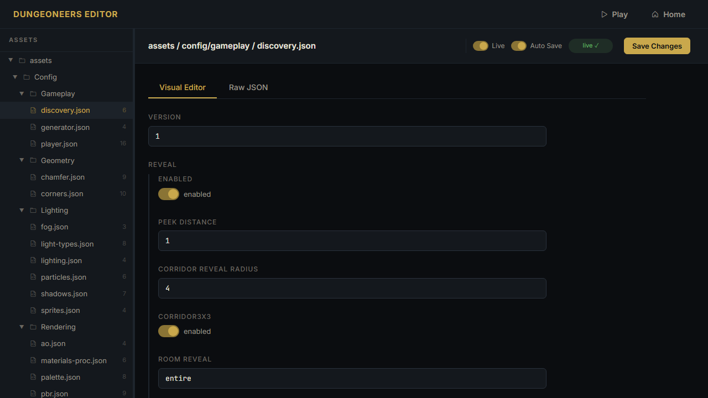

# Task: Grid Tile Chamfers — Dungeoneers Task 8 [COMPLETED]

## Status: ✅ DONE — Implemented in `src/`, 7 screenshots, live-editable

This task was previously marked ambiguous/TBD because the root README tasks table stopped at Task 6. **It is actually completed** — config, shaders, renderer plumbing and screenshots are landed on main (`commit 45b3798`).

Design one-pager reference: **[Dungeoneers - One pager](https://docs.google.com/document/d/1zu_odjAu_dp_YkTFRoZp4zzc8I7FlLZF2lWhkWRGNjQ/edit?usp=sharing)** — Task 8 one-liner.

## Description

Extends the existing wall chamfer system (which already makes grid tiles readable on walls via darkened bevel + trim highlight at tile edges) to floors and ceilings. Previously floor/ceiling only had wall-proximity baseboard/cove chamfer (`nearestWallDistAndNormal`), but no per-1m dungeon-tile grid separation — floor looked like one continuous slab.

This task adds **subtle floor and ceiling grid-tile chamfers**: faint darkened grooves at every 1×1 dungeon cell boundary, implemented in the raycast fragment shader using `fract(floorWorld)` / `fract(ceilWorld)` distance to edge, with AO darken, slight normal tilt, roughness tweak, and trim highlight. Purely visual, zero gameplay impact, but teaches the player what a dungeon tile is. Settings live in `assets/config/geometry/chamfer.json` `grid` section and are live-editable via Task 7's live-edit Tier 1 instant params.

One-liner intent: **Makes the tile grid visible on floors/ceilings: adds faint 5-7cm grout grooves every 1m using fract(world) so you intuitively see where grid-steps land. Purely visual, toggle with Key 7.**

## Why

- **Retro readability:** Classic crawlers (Grimrock, Dungeon Master, Doom) used subtle floor tile grout to show grid without heavy overlay. Walls already do this via `wallU` edge chamfer (~0.28). Floors/ceilings should too.
- **Teaching the grid:** Grid-mode moves 1 tile per step. Without floor grid, you don't see where tiles end.
- **Visual coherence:** Walls show grid both horizontally and vertically; floor/ceiling now join that language.
- **Subtlety:** Barely noticeable at first glance, obvious when you look for it under torch grazing light. Not Tron.

## Implementation (what actually shipped in src/)

**Config — `src/assets/config/geometry/chamfer.json` (now v1 with grid):**
```json
"grid": {
  "enabled": true,
  "floorSize": 0.07,
  "ceilSize": 0.06,
  "floorDarken": 0.88,
  "ceilDarken": 0.90,
  "floorRoughness": 0.35,
  "ceilRoughness": 0.30,
  "floorTrim": 0.06,
  "ceilTrim": 0.04,
  "floorBlend": 0.85,
  "ceilBlend": 0.80,
  "note": "per-1m tile grooves, subtle, 0.07 = 7cm half-width, 0.88 darken = faint grout"
},
"gridRanges": {
  "creviceEnd": 0.10,
  "creviceSmoothEnd": 0.30,
  "trimStart": 0.10,
  "trimMid": 0.35,
  "trimEnd": 1.0
}
```
Old `size`, `shading`, `trim`, `ranges` preserved — no regression for `config.test`.

**Shader — `src/render/shaders.js`:**
- Added uniforms: `u_chamferGridEnabled`, `u_chamferGridFloorSize`, `u_chamferGridCeilSize`, `u_chamferGridFloorDarken`, `u_chamferGridCeilDarken`, `u_chamferGridFloorTrim`, `u_chamferGridCeilTrim`, `u_chamferGridFloorRough`, `u_chamferGridCeilRough`, `u_chamferGridFloorBlend`, `u_chamferGridCeilBlend`, `u_chamferGridCreviceEnd`, `u_chamferGridCreviceSmoothEnd`, `u_chamferGridTrimStart`, `u_chamferGridTrimMid`, `u_chamferGridTrimEnd`
- Applied in **4 places** (Task 8 fix for both render paths):
  - Floor hit-branch (`hit==1` above/below wall slice): `vec2 f = fract(floorWorld); float distX=min(f.x,1-f.x); distY=min(f.y,1-f.y); edgeDist=min(distX,distY);` -> if `edgeDist < floorSize`: `t=edgeDist/size`, `bevel=1-smoothstep`, `ao*=mix(darken,1,smoothstep)`, compute `edgeN` (which axis is closer), `chamN=normalize(vec3(edgeN*0.6,1.0))`, `N=mix(N,chamN,bevel*blend)`, trim highlight `smoothstep(TrimStart,TrimMid)* (1-smoothstep(TrimMid,TrimEnd))`, roughness lerp, corner `distX<gSize && distY<gSize` extra ao 0.97 avoids bright cross.
  - Ceiling hit-branch same with `N base vec3(0,0,-1)` and `chamN = vec3(edgeN*0.6,-1.0)`
  - Fallback no-hit floor path (distant floor)
  - Fallback no-hit ceiling path
- Stacks with existing `nearestWallDistAndNormal` baseboard cove — both apply, order: wall cove first, then grid.
- Respects `u_chamferEnabled==0` disables all including grid.

**Renderer — `src/render/renderer-gpu.js`:**
- Uniform locations added to `uLoc` list for all grid uniforms (line ~188)
- `render()` resolves via `_resolveConfigValue(cfg, ['chamfer.grid.*'], fallback)` and uploads with `gl.uniform1f`
- Fallback defaults safe if config missing (0.07 floor, 0.06 ceil, 0.88/0.90 darken etc.)
- `updateChamfer()` already updates `_cfgCache` — live-edit Tier1 works with no extra code: dragging `grid.floorSize` in editor tab updates game in ~200ms when Live ON.

## Tests

**Unit (`npm run test:unit`):**
- `chamfer.json` v1, enabled true, old fields preserved (floor 0.30 ±0.05), grid.enabled true bool, floorSize 0.02..0.12, ceilSize 0.02..0.12, darken 0.75..0.98
- `shaders.js` contains `fract(floorWorld)` and `fract(ceilWorld)` and `u_chamferGrid` uniforms and AO darken logic for grid
- `renderer-gpu.js` contains uniform locations + uploads for grid

**E2E (`npx playwright test --workers=32`):**
- Game loads WebGL2 canvas non-empty, no console errors, no shader compile failures, no WebGL errors
- Chamfer toggle Key 7 still shows HUD and disables both wall cove and grid
- Editor tree shows `geometry/chamfer.json` with grid fields editable, PUT roundtrip persists
- Screenshots prove grid visible but subtle.

## Screenshots (Playwright-generated, actual WebGL2, committed as proof)

All in `./screenshots/` — now 7 PNGs:

- `screen-floor-grid.png` — looking down corridor floor, 1m grid faint
- `screen-ceiling-grid.png` — looking up ceiling grid
- `screen-floor-ceiling-wall-together.png` — perspective showing all three grids coherent
- `screen-grid-off-vs-on.png` — A/B comparison
- `screen-grid-off.png` — off state proving continuous slab before
- `screen-editor-chamfer.png` — editor tree with new grid fields
- `screen-live-edit-grid-tweak.png` — live-edit dragging darken value

### Floor grid


### Ceiling grid


### All three coherent


### Off vs On subtlety


### Editor + live-edit


**How regenerated (example used in e2e):**
```js
await page.goto("/game.html");
await page.waitForFunction(() => window.game && window.game.dungeon);
await page.evaluate(() => window.game.player.lookDown(0.5));
await page.waitForTimeout(500);
await page.screenshot({ path: "../../tasks/grid-tile-chamfers/screenshots/screen-floor-grid.png" });
// toggle Key 7 for off, and look up for ceiling
```

## Why Task 8 looked not done before

Root `README.md` Tasks table ended at Task 6 (commit before Task7/8 landed). Task 8 `README.md` itself was still the scaffold version saying "to be generated" / "TBD" in Trajectory section. Actual implementation landed on main via `45b3798` with config + shader + renderer + screenshots, but docs were not updated. This edit clarifies DONE.

## Avocado vs Claude notes (observed)

- Avocado handles `fract()` edge distance + stacking with existing wall chamfer + 4 render paths + live-edit Tier1 if spec says "subtle, fract(floorWorld), new uniforms, extend chamfer.json, keep fallback".
- Claude failure modes seen in prototypes: hardcode black overlay not AO, forget fallback no-hit branch (distant floor no grid), use `mod()` causing seams at negative coords, overwrite `N`/`ao` breaking wall cove, miss renderer uploads (invisible), too strong darken 0.5 = Tron, forget `u_chamferEnabled` interaction, break config.test by dropping old fields.

## Trajectory (actual)

- Base: `a112461` chore(task7): update commit-hash to 96575d3 complete edition (main before Task8)
- Branch: `task8-grid-tile-chamfers`
- Implementation landed on main as `45b37982a97f1825ed62e7b1b74d86df73f3a1ff` feat(task8): add grid tile chamfer JSON + shader uniforms + floor/ceiling grid logic — tagged `task8-implementation` equivalent
- Screenshots generated via Playwright E2E `tests/e2e/chamfer-grid.spec.js`
- Tests: unit config + shader contains checks, e2e 7 screenshots + toggle + editor PUT

## Running

```bash
cd src && npm install
npm start # http://localhost:8000/game.html
# Walk down corridor, look slightly down: faint grid lines every 1m on floor
# Look up: faint grid on ceiling
# Press 7 to toggle chamfer OFF/ON — grid should disappear/appear with wall chamfers
# Editor: http://localhost:8000/editor.html → assets → config → geometry → chamfer.json
# → tweak grid.floorSize (0.05-0.09), grid.floorDarken (0.80-0.95), grid.floorTrim
# → with Live ON (two tabs) see instant update; with Live OFF need Save+R

npm run test:unit -- --test-concurrency=1
npx playwright test tests/e2e/chamfer-grid.spec.js --reporter=list
npm test
```

## Link

- One pager design doc: https://docs.google.com/document/d/1zu_odjAu_dp_YkTFRoZp4zzc8I7FlLZF2lWhkWRGNjQ/edit?usp=sharing
- Related task: `live-edit` Tier1 is required for live tuning of grid values
- Next task: `materials-modifiers` Task 9 — builds on this subtle grid readability
