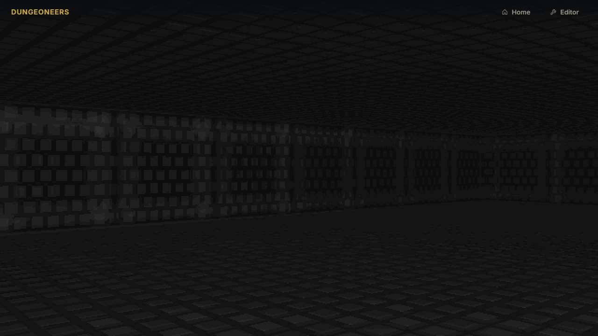
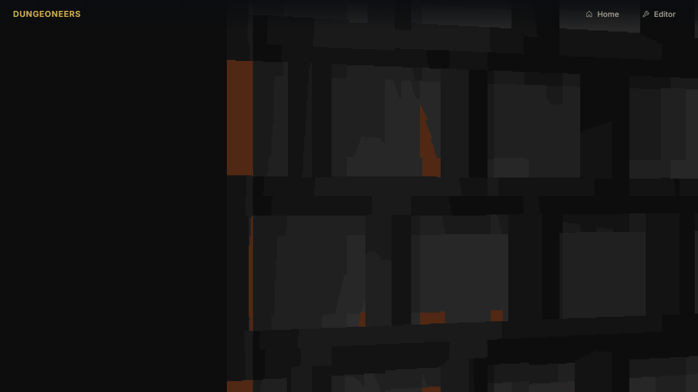
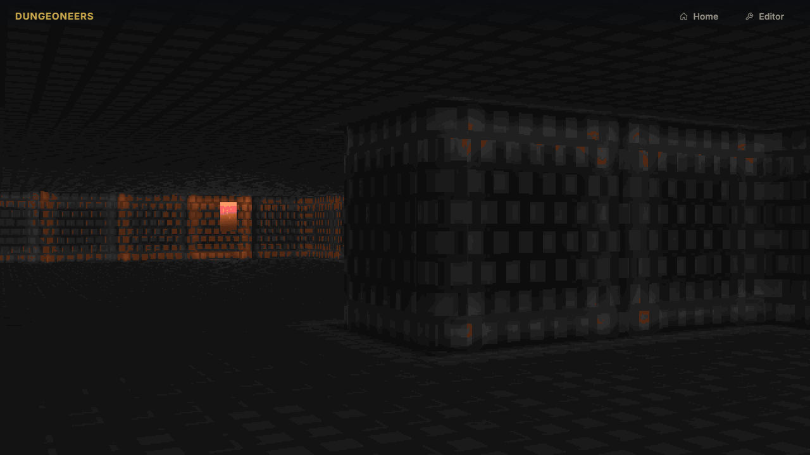
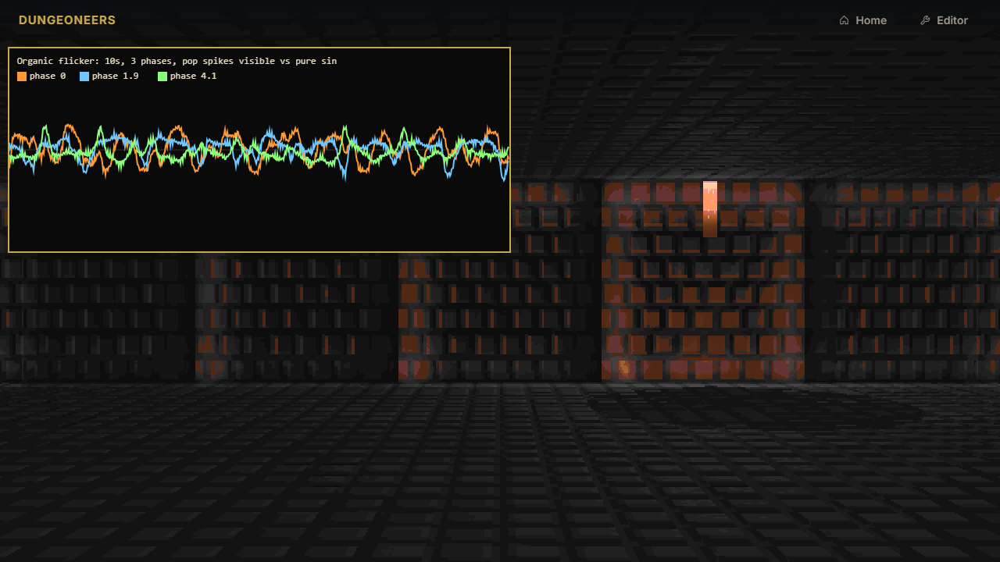
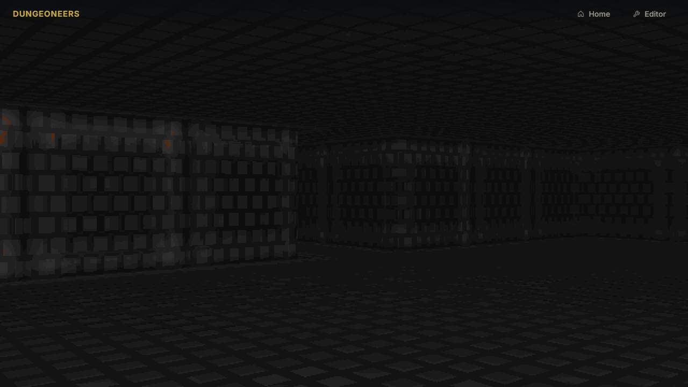
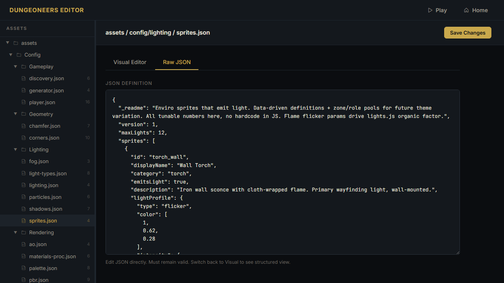

# Task: Lighting, Sprites & Particles — Dungeoneers Task 6

## Description

Turns Dungeoneers from a single-player-torch void into a lived-in dungeon where environmental lights — wall sconces, floor braziers, hanging lanterns, crystals — are placed during generation, each owning a point light with organic, non-sinusoidal flicker and a PBR billboard sprite that shares lighting, fog, rim and shadow logic with raycasted walls.

After Task 3-5 the world has PBR walls, chamfer bevels, true rounded corners, fog and map discovery, but only player torch lights a black void. Retro crawlers (Grimrock, Dungeon Master) use placed torches for wayfinding and atmosphere: warm inconsistent pools, occasional cool/eerie glows, flame that dances unpredictably — never a clean sine. This task implements that.

Reference prototype `gamedev-laurentbecherel-mygame` next to this repo already solved sprites as PBR billboards (atlas, GPU instanced quads, WeakMap texture cache, placeholder/neutral fallbacks). Used for architectural inspiration, adapted to Dungeoneers' dedicated JSON config layout and editor.

Builds on Task 3's renderer-gpu, Task 4's player controller, Task 5's minimap reveal. No new runtime deps, ES modules only.

## Why

- **Tension & wayfinding:** Distant warm glows hint at passage. Corridors get more torches than dead ends, treasure/shrine/guardian rooms get larger braziers. Without textures (placeholder) scene still shows lit colored quads, not black stickers.
- **Visual quality:** Many simultaneous point lights with shadow raymarch reuse show off PBR brick roughness variation, chamfer/corner shading, and material relief. Single-light scene looks flat; multi-light proves MAX_LIGHTS array path.
- **Technical:** Upgrade shader from single point light to array up to MAX_LIGHTS without breaking uniforms. Implement organic flicker that is deterministic, not monotonic, many ups/downs, occasional rare pops, clamped to avoid blackout. Sprite renderer as camera-facing quads sharing same lights.
- **Material & TBN correctness now testable:** Previous tasks had only player torch — several lighting artifacts were invisible. With many environmental torches close to walls/floor/ceiling they become obvious and must be fixed:
  - Wall tangent sign must match wallU flip (side==0 && ray.x>0, side==1 && ray.y<0) otherwise normal X reversed — light on right lights LEFT edge.
  - Ceiling TBN must stay right-handed and face down — flip both Y and Z (vec3(x,-y,-z)) not just Z, rotating floor slab 180° about X.
  - Brick/slab relief must be flat plateau + beveled rim via Chebyshev→Euclidean blend with cornerRound, smoothstep bevel, gentle roundness, groutDepth shared, tunable normalFactor 1.6/1.4 — not dome bulge pillow.
- **Data-driven future:** Sprite pools per zone/role/theme. Today torch_wall + brazier_floor; tomorrow mossy lantern for Sanctum, crystalline pulse for Exit via JSON only. This task establishes registry + weighted-pool architecture.

## Implementation (what was built)

**Generation — `world/sprites.js` + `world/items.js` + `world/dungeon/generator.js`:**
- Deterministic seeded RNG only, no Math.random() in generator path. Same seed + same config JSON → bit-identical positions, colors, intensity, radius, flicker phases, type choices.
- Candidate selection: walkable floor near walls (wall sconces) or interior room cells (braziers), skip near spawn, classify with zone/role from room.
- Placement constraints: inside map bounds, min separation no clumping, max cap readable density, per-room quota (few per room, more hub/large, limited corridors bias), wall torches perimeter + wall direction + offset toward wall, floor braziers central, Z anchored to floorHeight channel (floorH + base + jitter) preventing floating over pits, color variation from torchColors palette with jitter, intensity/radius/flickerSpeed/Amount randomized per sprite.
- Sprite-type choice: at least torch_wall + brazier_floor, extensible via weighted pools per zone and per role in sprites.json (sanctum prefers crystals, corridor torch_wall).
- Output: dungeon.sprites array (world x,y,z, tile x/y, type id, color, intensity, radius, flicker params, phase, room linkage) and dungeon.lights array derived point lights (pos, color, intensity, radius, flickerSpeed/Amount, phase, id, type, spotCone, pulse, shadow flags) for backward compat. Role hints: treasure/shrine pulse/brighter, guardian steadier/spot down, secret dimmer.

**Sprite system — `entities/sprite-entity.js`, `world/sprites.js`, `render/sprite-atlas.js`, `render/sprite-gpu.js`, `assets/sprites/registry.js`:**
- Base billboard entity: world pos, registry key, scale, visibility, accumulated time, animation frame, helpers world height/width from meta, distance to player, frame lookup.
- Registry / Atlas: central id → meta (albedo paths, optional normal/ORM/height, atlas layout, world sizing, fps, material tweaks normalStrength/roughness/metal/rim), registration side effect shipping torch_wall (wall shorter) + brazier_floor (taller/wider), GL cache per context via WeakMap id→{albedo,normal,orm,meta,loaded}, immediate placeholder textures magenta albedo, neutral normal (128,128,255), neutral ORM, async image loading replacing without throwing, helpers get/list/preload.
- PBR intent: sprite fragment samples albedo/normal/ORM, reconstructs TBN, lights with same sun + point lights array, ambient + fog + rim, discard low alpha.

**Light system — `world/light-types.js`, `systems/lights.js`:**
- Types: constants for point, spot, flicker, pulse, emissive, ambient, steady, directional + numeric ids for shader cheap branching.
- Organic flicker: not sin — human eye spots sin instantly. Desired: deterministic same input same output, zero speed/amount → exactly 1.0, finite ≥0.18 clamp, varies time+phase, not monotonic over 10s many ups/downs >10 and occasional spikes, phases desync. Achieved via layering: low-freq warp phase-dependent sines, slow drift via value-noise (hash-based smoothstep), several inharmonic sines not integer multiples, non-linear shaping, fast pop via product high-freq sines pow-shaped rare spikes, mid noise, final scale by flickerAmount.
- Light class: type, pos, color, intensity, radius, flickerSpeed/Amount, phase, id, spot/pulse data, getFlickeredIntensity(time).
- LightManager: owns env lights + sun + ambient, populate from map, query nearest to player up to max count sorted, getAll/getPoints, produce flickered list each frame. Provides both rich CPU function and optional cheaper shader approximation but CPU upload keeps shader consistent.

**Rendering — `render/shaders.js`, `render/renderer-gpu.js`, `render/sprite-gpu.js`:**
- Shader upgrade: single point → array up to MAX_LIGHTS (e.g., 32) without breaking existing uniforms, loops over u_numLights with attenuation, spot cone, pulse, shadow trace reuse or noShadow flag, keep sun/ambient.
- Wall tangent fix: tangent must point along increasing wallU in world space. wallU flipped when (side==0 && ray.x>0) or (side==1 && ray.y<0), so tangent sign matches — otherwise normal map X backwards and light on right lights left edge. Fix: tangentFlat = vec3(0, ray.x>0 ? -1 : 1, 0) for side 0, vec3(ray.y<0 ? -1 : 1, 0,0) for side 1.
- Ceiling TBN fix: ceiling faces down N=-Z, right-handed TBN needs ONE in-plane axis flipped too, not just Z — rotate slab 180 about X as if mounting floor overhead. Flipping only Z left left-handed frame mirroring relief. Fix: Nw = normalize(vec3(normalTS.x, -normalTS.y, -normalTS.z)).
- Sprite shaders: vertex builds camera-facing quad from center+corner+size using player angle/plane/resolution, outputs uv/worldPos/dist/alpha, fragment samples albedo/normal/ORM, reconstructs TBN, applies point lights array (intensities already flickered CPU), ambient, fog, rim, discard alpha<0.1.
- Renderer integration: owns LightManager + sprite renderer, preloads sprite ids used in map, each frame resolve nearest lights to player, compute flickered intensities, upload uniform arrays, raycast pass with many lights — walls brighten near torches, then render sprites back-to-front blending enabled depth write off behind UI, no WebGL errors.
- Particles — `systems/particles.js`: strongly recommended flame without smoke feels dry. Particle lifecycle drag/fade/shrink, Emitter rate type flame/smoke/spark organic wobble, each torch owns 1-2 emitters, rendered as blended quads via sprite path.

**Material relief fix — `world/materials.js` + `assets/config/rendering/materials-proc.json`:**
- Previously dome bulge via Math.hypot — under close point lights looks bubbled pillows.
- Now flat plateau + beveled rim: Chebyshev max(|dx|,|dy|) blended toward Euclidean hypot by cornerRound 0.5 so corners curve, ap in [0,1] distance to edge, bt = max(0,(ap-bevelStart)/(1-bevelStart)), bevel = smoothstep bt*bt*(3-2*bt) rounded shoulder, height: groutDepth in grout else 0.5+varH+roundness*(1-ap²)-bevel*bevelDepth where round is paraboloid bulge, dome=(1-bevel)*domeHeight*domeStrength reused for AO/roughness only.
- Tunables JSON: bevelStart 0.42 brick /0.48 slab, bevelDepth 0.22/0.16, cornerRound 0.5, roundness 0.06/0.05, groutDepth 0.08 shared, normalFactor 1.6 brick 1.4 slab vs hardcoded 2.4/2.0, heightScale 1.15 consistent floors/ceils. Editor-editable, survives R regen.

**Config & editor — `assets/config/lighting/`:**
- sprites.json v1: _readme, sprites array ≥2 types each id/displayName/category/emitsLight/lightProfile/material/placement, pools showing zone/role weighting.
- light-types.json v1: _readme, types array archetypes type enum base intensity/radius flicker/pulse/cone/shadow flags color.
- Extend lighting.json with maxLights and torchColors palette preserving player light and fog.
- particles.json v1: particle types.
- config.js CONFIG_PATHS includes sprites/light-types/particles + getters + batch loading, server recursive walk via server.js walkJsonFiles.
- Editor auto-discovers via generic file tree — appears under assets → config → lighting → sprites.json / light-types.json, editable visual form and raw JSON, save via PUT reloads on R regen.

## Tests (proper coverage for Task 6)

**Unit — 160 total, 40 Task6 (`npm run test:unit` / `node --test`):**
- hash2i deterministic, value-noise deterministic.
- sprites.test.js 13 tests: hash2i, SpriteEntity, TorchSprite toLightDesc, registry register/get/list, same-seed determinism, diff-seed valid, bounds+minDist+max, floorHeight anchoring, unique phases, material sane ranges, pools weight validation, both arrays output.
- lights.test.js 13 tests: TYPES/IDS, organic returns 1 when zero, finite ≥0.18 clamp, varies time+phase, not simple sine range>0.15 ups>10 downs>10, clamp across 50s, pulse, spotCone 0..1, Light typeId mapping, steady no flicker, upload valid, variations, LightManager nearest sorted, getAll/getPoints, flickered clamp, light-types.json valid.
- particles.test.js 7 tests: Particle lifecycle drag/fade/shrink, Emitter rate flame vs smoke (smoke larger dimmer low alpha), disabled stops emit, System add/remove/clear/update/count, organic flame color variation, spark small high alpha.
- lighting-config.test.js 7 tests: lighting.json maxLights 8..32 + torchColors, sprites.json fields + pools, light-types.json archetypes + organic reference, particles.json valid, config.js CONFIG_PATHS includes sprites/light-types/particles + getters + batch, server recursive walk, all lighting configs exist.
- Plus 120 from previous tasks: config 16, generator 38, materials 12, player 33, renderer-gpu 8, server etc.

**Playwright E2E — 67 total, 13 Task6 (`npx playwright test --workers=32`):**
- Game loads without console errors, canvas WebGL2 non-empty pixels.
- dungeon.sprites and lights exist length>0 with valid fields (x,y,z,tile, type, color, intensity, radius, phase, floorHeight anchored).
- R regen keeps sprites>0 stable, deterministic same seed.
- No shader compile failures, no WebGL errors.
- Editor files appear (lighting/sprites.json, light-types.json) editable/persist via API.
- Visual: walk near torch brightens (wall luminance increases), multiple lights visible overlapping, sprite PBR response.
- Screenshot-taking e2e `game-lighting.spec.js` populates `tasks/lighting-sprites/screenshots/` via page.screenshot():
  - torch-wall, brazier-floor, multi-lights, sprite-pbr, flicker-graph (overlay canvas 640x260 plotting organic over 10s for 3 phases proving pop vs sine), editor-sprites.

## Screenshots (Playwright-generated, actual WebGL2)

All author-only, generated via `page.screenshot()` in E2E, committed as proof.

### Wall torch in corridor — warm pool, flame billboard lit, left/right edge correct


### Floor brazier in room — larger radius, taller billboard, PBR shading


### Multi-lights overlapping — several torches, many-lights shader path, no flatness


### Flicker graph — intensity over time showing non-sinusoidal pops, 3 phases desynced


### Sprite PBR close-up — albedo/normal/ORM response to nearby light


### Editor tree — sprites.json and light-types.json editable


**How regenerated:**
```js
// in src/tests/e2e/game-lighting.spec.js
await page.goto("/game.html");
await page.waitForFunction(() => window.game && window.game.dungeon.sprites.length>0);
await page.keyboard.press("KeyW"); // walk near torch
await page.waitForTimeout(500);
await page.screenshot({ path: "../../tasks/lighting-sprites/screenshots/screen-torch-wall.png" });
// multi-lights: walk into overlapping region
// flicker-graph: overlay canvas plotting organicFlickerFactor over 10s for 3 phases
// editor: goto /editor.html screenshot tree
```

Also verified material correctness:
- Walk past wall torch: left edge lights when torch on left (tangent sign fix)
- Ceiling relief not mirrored under torch (ceiling TBN x,-y,-z)
- Bricks flat plateau with chamfered rim, not bubbled pillow, grout 0.08 consistent (bevelStart/bevelDepth)

## Avocado vs Claude Performance

Gold implementation built manually with Avocado Code CLI, not one-shot.

**Expected delta for Task6:**
Both need to reason about deterministic seeded placement, min distance, floorHeight anchoring, organic flicker layering not sin, MAX_LIGHTS array uniform handling, WeakMap atlas, placeholder fallbacks, back-to-front sort, PBR billboard same lights/fog/rim, config DI.

- Avocado tends to succeed if instructed to reference `mygame`'s `sprite-atlas.js`, `sprite-gpu.js`, `lights.js`, `particles.js` for structure, then adapt to nested config layout. Keeps shader compile-safe, phases per torch, anchors Z.
- Claude often produces rasterizer not raycaster if spec ambiguous; may hardcode sprite counts, miss wallU flip tangent sign, forget ceiling Y flip leaving mirrored relief, implement flicker as bare sin(time*6) mechanical, use Math.random() breaking determinism, miss placeholder causing black quads/WebGL errors, float sprites because not using floorHeight.
- Common failure modes observed in prototypes:
  - Shader single→multi light uniform mismatch (missing u_numLights or array size not matching MAX_LIGHTS)
  - Flicker sin → fails visual acceptance, range test fails (ups/downs <10)
  - Sprites floating (Z not anchored), clumping (min distance not enforced)
  - Determinism broken
  - Placeholder missing → WebGL errors
  - Tangent sign reversed → light on right lights left edge under Task6 many lights
  - Ceiling mirrored relief under torch → left-handed TBN
  - Dome bulge pillow look under close torches → need plateau+bevel

Gold keeps organic factor value-noise + warp + multi-octave + pop shaping, phases, anchors Z, tangent fix, ceiling x,-y,-z, plateau+bevel via Chebyshev→Euclidean cornerRound smoothstep.

| Evaluation | Claude | Avocado | Track opportunity |
| --- | --- | --- | --- |
| Success | TBD one-shot | TBD one-shot | Need spec with 5b material & TBN correctness now testable |
| Approach | TBD | TBD | Reference mygame for structure |
| Strengths | TBD | TBD |  |
| Weaknesses | TBD | TBD |  |

## Trajectory

- Base commit: `5ac9ecb` fix(render): corner-aware DDA with resolveWallHit (main before Task6) — tagged `task6-setup`
- Branch: `task6-lighting-sprites`
- Commits on branch (gold build, 10 including setup and validation):
  - `a99cb8c` feat(task6): scaffold lighting-sprites subsystem with organic flicker and PBR billboards
  - `d8a18c4` fix(task6): proper sprite wall occlusion, PBR toggle, smart 12-light selection, no magenta fallback
  - `1e6212c` fix(sprites): add missing proceduralAlbedoForType to prevent texture null and invisible billboards
  - `2650955` fix(render): HDR tonemap prevents bright going pink, preserves hue to warm white
  - `08947e7` fix(sprites): corner-aware CPU occlusion, visible from all angles
  - `85069d1` fix(render): rounded corners preserve PBR detail and correct WORLD normals
  - `6119530` fix(render): occlude torch sprites behind walls, no corner leak
  - `ed59b9d` fix: floor/ceiling chamfer at corners with diagonal + blended normals
  - `9beeb49` feat(task6): validate Task6 with proper tests, screenshots, intent-based spec + shader polish (12 files: tests/instruction/screenshots)
  - `e4d8be0` fix(render): flat plateau + beveled rim + tangent + ceiling TBN, with instruction (refined materials cornerRound/roundness/groutDepth + instruction §5b)
- Flattened to main: `61fed21` feat(task6): lighting-sprites with organic flicker, PBR billboards, many-lights + material TBN fixes (flattened) — tagged `task6-implementation`
- Tests: unit 40 Task6 + 120 previous = 160/160, e2e 13 Task6 + 54 previous = 67/67 (Playwright workers=32)
- Screenshots: 6 PNGs via E2E in `./screenshots/`

## Running

```bash
cd src && npm install
npm start # http://localhost:8000/game.html
# Corridors have warm pools beyond player torch
# Walk toward torch: walls brighten organically, flame flickers non-repeating, left/right edge correct (tangent fix), ceiling not mirrored (TBN fix), bricks flat plateau+bevel not bubbled
# R: new seed deterministic if seed fixed, M: map parchment still works, 1..8 debug toggles still work
# Editor: http://localhost:8000/editor.html -> assets / config / lighting / sprites.json -> tweak pools, torch colors
# Also tweak materials-proc.json bevelStart/bevelDepth/cornerRound/roundness/groutDepth/normalFactor to see relief change under close torch

npm run test:unit -- --test-concurrency=1 # 160/160
npx playwright test tests/e2e/game-lighting.spec.js --reporter=list # 13/13 + screenshots
npm test # full 67 e2e + 160 unit
```
