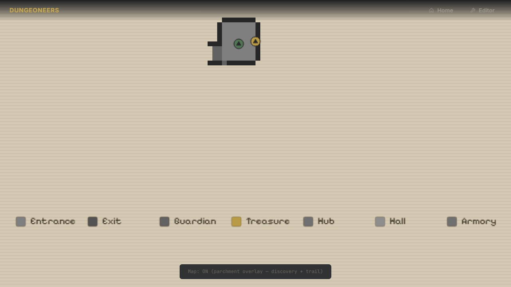
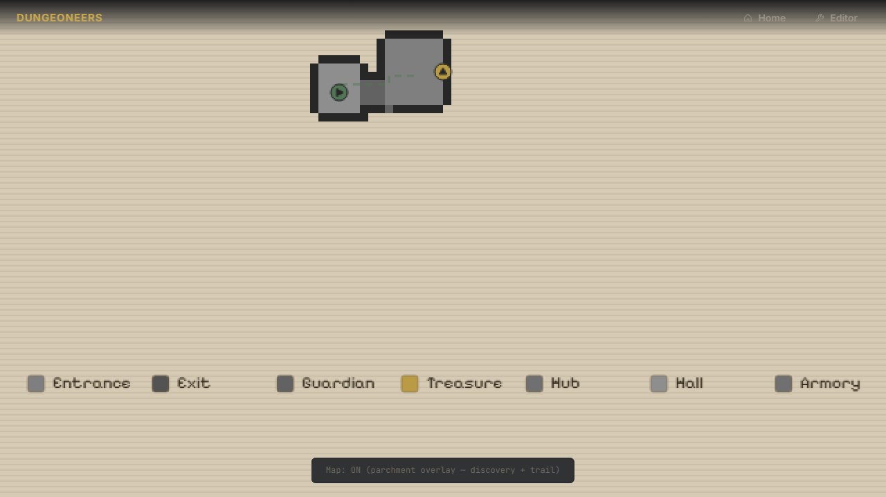
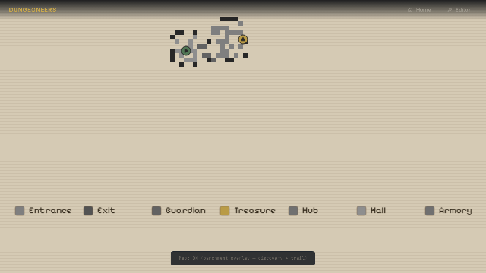
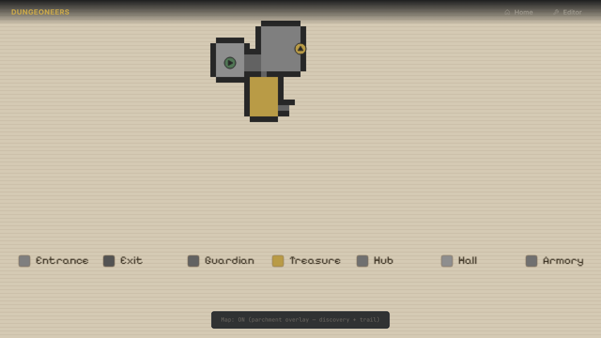
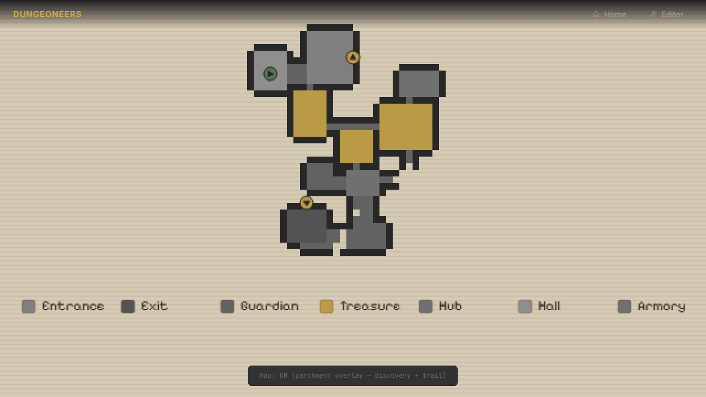

# Task: minimap-reveal

## Description

Fog-of-war discovery for the parchment minimap — turning the automap from a spoiler into a core exploration mechanic. On spawn only the entrance room + 1-tile doorway peek is visible; the rest is parchment. As you walk into new rooms/corridors, `DiscoveryManager` reveals whole room interiors + perimeter walls + 1 tile peek beyond each doorway, never beyond. Corridors reveal incrementally (3x3 local + BFS along corridor radius) with 1-tile peek into adjacent rooms.

When opening the map (M), newly discovered cells since last open animate with retro dithering (random hash / Bayer 4x4) over configurable duration (~400ms). A transparent dashed trail (`trail.color`, `opacity`, `dash`, `lineWidth`) shows walk history, clipped to discovered cells, persistent across M toggles, reset on R regen.

Builds on Task 3/4's `dungeon/generator`, `map-ui`, `game`, `player`, `config`. No new deps, ES modules only.

## Why

- **Tension:** Full map on spawn kills curiosity. Hiding topology makes finding exit/stairs earned, like Grimrock / Eye of the Beholder automap.
- **Retro feel:** Dither draw-in (popping dots, not smooth fade) reinforces CRT/plotter aesthetic — you see progress since last M check.
- **Orientation:** In 40x40 maze with 1-tile peek you get lost. Dashed transparent trail solves navigation without spoiling undiscovered topology.

## Implementation (what was built)

- `world/discovery.js` — Pure fog-of-war manager, single responsibility, Node-testable, no Canvas/DOM/Game import, DI via config:
  - Exports `getRoomAt(x,y,dungeon)` and `class DiscoveryManager`
  - State: `Uint8Array discovered`, `Int32Array order`, `_orderCounter`, `path[]`, `lastMapOpenMaxOrder`, `pendingNew`, `animationStartTime`, `_cfg`
  - `_resolveCfg(cfg)` normalizes `reveal{enabled,peekDistance,corridorRevealRadius,corridor3x3,animationDuration,dither{pattern,bayerSize},undiscovered,oldRoomOpacity}`, `trail{color,opacity,lineWidth,dash,cap,join,maxPoints,onlyDiscovered}`, `playerDir`
  - Small focused helpers (<30 lines): `_markCell`, `_revealSurroundingWalls` (walls only), `_revealRoom` + `_revealRoomBorder`, `_revealPeekLine(doorX,doorY,dirX,dirY,peek)`, `_revealPeekForRoom` loops perim calling peek line, `_revealCorridorAt` + `_revealCorridorBFS` BFS radius along non-room floors with room entrance peek
  - Idempotent `markDiscoveredAt(px,py,dungeon)` returns newly list, `addPathPoint`, `onMapOpened(now)`, `getAnimationProgress(now,dur)`, `getPath()`, `getNewlyDiscoveredSinceLastOpen()`, `getAllDiscovered()`, `setLastOpenMaxToCurrent()`, `addPendingWhileMapOpen(newly)` bug-fix for live discovery while map open
  - Deterministic hash for dither in render, not in logic; out-of-bounds safe via `_inBounds`

- `world/map.js` facade — Delegates `getRoomAt` to `discovery.js` single source to avoid duplication (`import {getRoomAt}`).

- `assets/config/gameplay/discovery.json` v1 — Dedicated editor-tracked file discovered by `server.js:33 walkJsonFiles` recursive scan, appears as `assets / config / gameplay / discovery.json` in tree. Contains `_readme` explaining tunables, `reveal`, `trail{color [88,128,92] muted green #58805c, opacity 0.45, lineWidth 2, dash [5,4], cap/join, maxPoints 1024, onlyDiscovered}`, `playerDir{color [42,42,42]}`, `debug`. No `colorCss` duplicates, no hardcoded magic in JS — all numbers via DI with fallback defaults.

- `render/map-ui.js` — Parchment minimap with fog masking + dither + trail, pure rendering no mutation:
  - `resolvePaletteConfig/uiCfg`, `resolveLayout(uiCfg)` uses `layout.playerDot.minRad/sizeFactor` and `layout.player.color/dirColor`
  - `resolveDiscoveryCfg(discovery, discoveryCfg)` deep-merges instance + file
  - `bayerMatrix4()`, `hash01(x,y,order)` deterministic, `shouldDrawCell` checks `isDiscovered` + `newlySet` + animProgress + pattern bayer/random, respects `bayerSize` from config
  - `getUnifiedIconRadius(cs,layout)` uses `layout.player.minRad` and `sizeFactor` (not hardcoded 6/0.9), border color from `palette.wallDark` (not hardcoded "#2a2a2a")
  - Helpers extracted: `calcGridLayout`, `buildRoomCellMap`, `drawParchmentBg`, `drawDiscoveredCells`, `drawRoomsRounded`, `drawStairsCanvas` (entrance gold circle dark triangle up, exit down — same radius/border), `drawTrailCanvas` (dashed transparent, clips to `onlyDiscovered`, breaks on distance>2), `drawPlayerCanvas` (muted green circle dark triangle facing angle), `drawLegendCanvas`, `drawCellsToBuffer` fallback pixel buffer path
  - `generateMapTextureData(dungeon,mode,player,uiCfg,discovery,animProgress,discoveryCfg)` backward compat handles discovery as number

- `core/game.js` — Orchestration only, owns DiscoveryManager:
  - `_pickCfg` + `_mergeDerivedRenderConfigs` split from god `_mergeConfigs`, `DEFAULT_DISCOVERY_FALLBACK` constant uses green [88,128,92] matching discovery.json
  - `_initDiscovery()` creates/resets manager for start room + path
  - `_updateDiscovery()` on grid move returns newly, `addPendingWhileMapOpen` if showMap
  - `_loop` computes `animProgress` via `getAnimationProgress` and calls `ui.drawMap` with discovery + progress + cfg directly (removed fragile `drawMap.length` check)
  - R regen resets discovery, M toggle drives `onMapOpened`, HUD messages, bob presets fallback constant `BOB_PRESETS_FALLBACK`

- `ui/ui.js` — WebGL UI wrapper validates discovery shape via `isDiscovered` fn (not fragile number check), delegates to `generateMapTextureData`

- `config/config.js` — Fixed `CONFIG_PATHS['discovery']` duplicate entries, removed leftover `config/gameplay/minimap-reveal`, now `['config/gameplay/discovery','config/discovery','config/ui/map','config/main']` and `map: ['config/ui/map','config/map','config/main']`; `getDiscoveryConfig()`, `saveDiscoveryConfig()`, included in `getAllRenderConfigs()`

- `tests/unit/discovery.test.js` — 8 focused unit tests: starts false, spawn <15 walkable, room interior+perimeter, peek invariant 1 beyond but not 2, corridor incremental + peek into room, path tracking dedup consecutive + reset clears, idempotent same room, animation capture pending and progress 0..1 clamped

- `tests/e2e/game-reveal.spec.js` — 7 E2E: initial coverage <0.5, walking reveals more, M open dither progress observable, trail persists across toggles, R regen resets to <0.5 ratio and path 1-2, editor API discovery.json, config.js contains discovery

## Tests (proper coverage for Task5)

**Unit — 120/120 100% pass (`node --test tests/unit/*.test.js`):**
- 16 config tests: all dedicated configs exist, main v3 delegates, pom centered 0.5 grazing safety, fog exp squared base 0.06, shadows bias snap, ao per-light, pbr emissive clamp debug 0..8, chamfer floor 0.30 ceil 0.24 wall 0.28, corners radius 0.15 mode 2, rendering fov+eye+surface, map Pixelify Sans parchment, debug keys, generator roomAttempts 200 single material, lighting ambient+sun, CONFIG_PATHS covers all, server recursive walk slash allowed favicon 204
- 8 discovery tests (see above) dedicated to Task5 invariants
- 38 generator tests, 12 materials atlas, 33 player controller polish (grid, bob figure-8, mouse look, presets, etc), 8 renderer-gpu, 4 server nested API

**Playwright E2E — 54/54 100% pass (`npx playwright test --workers=32`):**
- 39 from Task3: WebGL2 640x360, 3D non-black, WASD/QE, R regen, M fullscreen parchment opacity, toggles 1..8, PBR debug cycle HUD, fog/chamfer/corners/pom centered clamping/shadows bias/ao per-light/palette, map parchment Pixelify Sans, generator lock, favicon, landing, editor hierarchical
- 8 from Task4 `game-controller.spec.js`: G grid HUD, V/B bob HUD, P presets HUD, bob observable via `window.game.player`, presets API, bob toggle both modes, AZERTY ZQSD code mapping, pointer lock + mouse, player.json v2 + CONFIG_PATHS
- 7 from Task5 `game-reveal.spec.js` (see above) — previously flaky R regen test fixed to assert ratio <0.5 and path 1-2 instead of cross-dungeon size comparison, now stable 3/3

## Screenshots (Playwright-generated, actual game)

> For README / catalog, author-only, generated via `page.screenshot()`.

### Map initial reveal (spawn, only entrance + 1 tile peek, <30% floor)


### Corridor peek (inside room, doorway shows 1 tile into corridor, tile 2 hidden)


### Room reveal (after entering second room, two rooms + corridor visible)


### Dither animation (mid progress 0.4-0.6, dotted filling)


### Path trail (dashed transparent muted green, showing walked path)


### Full explored (after exploring most floor, trail covering maze)


**How regenerated:**
```js
// temporary E2E
await page.goto("/game.html");
await page.waitForFunction(() => window.game && window.game.discovery);
await page.keyboard.press("KeyM");
await page.screenshot({ path: "../tasks/minimap-reveal/screenshots/map-initial-reveal.png" });
await page.keyboard.press("KeyM");
// walk W into corridor / new room
for (let i=0;i<5;i++){ await page.keyboard.press("KeyW"); await page.waitForTimeout(400); }
await page.keyboard.press("KeyM");
await page.screenshot({ path: "../tasks/minimap-reveal/screenshots/map-room-reveal.png" });
await page.waitForTimeout(100); // mid dither
await page.screenshot({ path: "../tasks/minimap-reveal/screenshots/map-dither-animation.png" });
await page.goto("/editor.html");
await page.screenshot({ path: "../tasks/minimap-reveal/screenshots/editor-discovery-config.png", fullPage:true });
```

## Avocado vs Claude Performance

TBD — run after gold branch ready, comparing one-shot `instruction.md` runs.

Expected delta for Task5: Both need to reason about room containment vs corridor BFS + 1-tile peek invariant + fog masking + dither animation + trail clipping. Avocado likely handles pure logic + render masking + config DI; failure modes: forgetting R reset, leaking undiscovered via 3x3 around peek beyond 1 tile, animating old cells repeatedly, path drawing across gaps, hardcoding colors/radius/border, duplicated getRoomAt, using function.length hack, not exposing `window.game.discovery` for E2E, flaky regen test comparing cross-dungeon sizes.

| Evaluation | Claude | Avocado | Track opportunity |
| --- | --- | --- | --- |
| Success | TBD | TBD | TBD |
| Approach | TBD | TBD | TBD |
| Strengths | TBD | TBD | TBD |
| Weaknesses | TBD | TBD | TBD |

## Trajectory

- Base commit: `efedd83` feat(dungeon): compact layout to ~60% — 40x40 map (latest main at time of branch)
- Branch: `task5-minimap-reveal`
- Commits on branch (gold build):
  - `f889fba` chore(task): scaffold task5-minimap-reveal
  - `b902177` feat(map): minimap reveal & discovery with retro dither + dashed trail
  - `6222601` fix(map): bugfix discovery while map open + player direction caret + screenshots
  - `6979a18` fix(map): consistent circle+triangle icons, muted green player, trail same green, both JSON configurable
  - `dbf450e` fix(map): entrance/exit literally same except orientation, all circle+triangle consistent
  - `f3717ee` refactor(map): code quality - extract helpers, dedup, remove hardcoded values, fix CONFIG_PATHS, fragile signature, flaky test (120 unit / 54 e2e pass)
  - `4d11d31` docs(task5): make instruction intent-focused and fair for training
- Tests: unit `discovery.test.js` 8 + config 16 + others 96 = 120/120; e2e `game-reveal.spec.js` 7 + 47 previous = 54/54

## Running

```bash
cd src && npm install
npm start                                    # manual → http://localhost:8000/game.html
npx playwright test tests/e2e/game-reveal.spec.js --reporter=list # E2E task5 → 7/7 (auto starts on 8005)
npm run test:unit -- --test-concurrency=1    # unit 120/120
npm test                                     # full
# Game loads start room only. M toggles map, newly discovered dithers retro pop over ~400ms (tunable). WASD/ZQSD walk reveals rooms/corridors with 1-tile peek. Trail dashed transparent persists, R regen resets to start only.
# Editor: http://localhost:8000/editor.html → assets → config → gameplay → discovery.json → tweak reveal.peekDistance, animationDuration, dither.pattern, trail.opacity/dash/color
# Also: assets → config → ui → map.json → parchment colors still tunable
```
