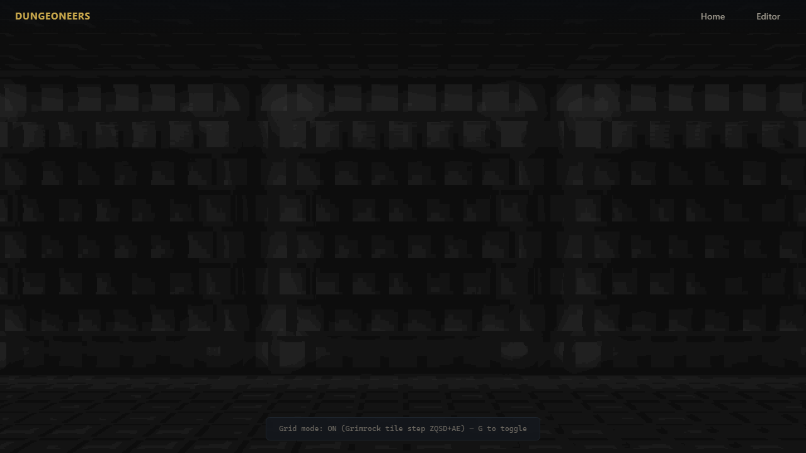
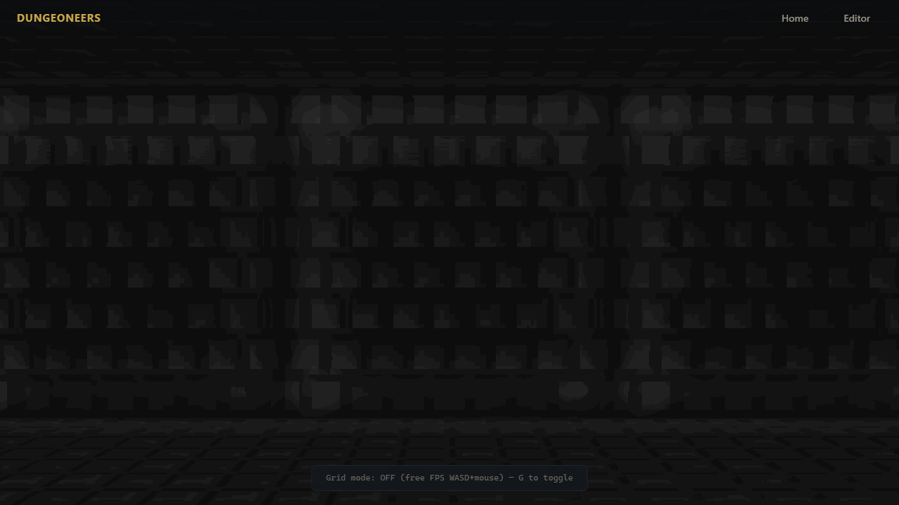
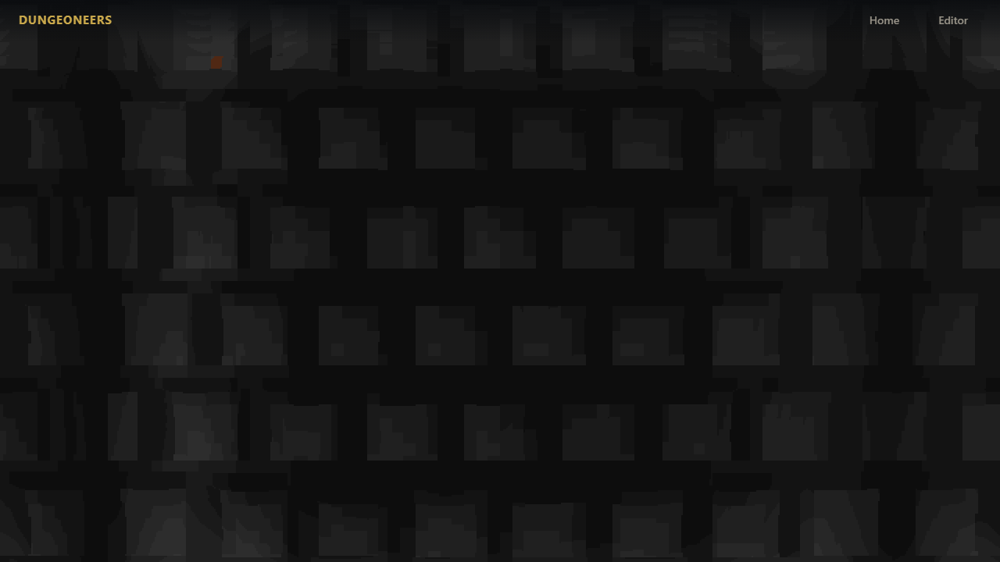
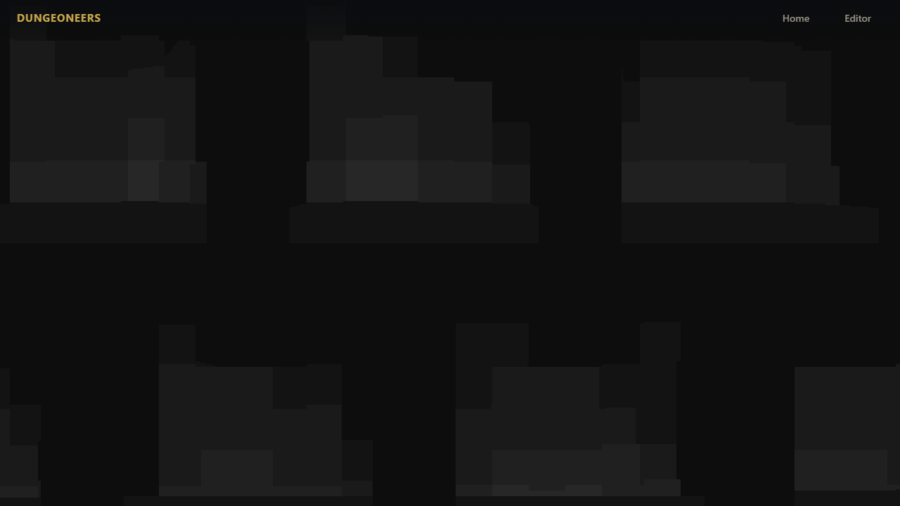
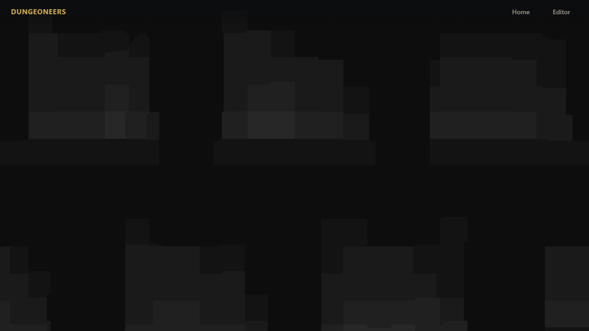
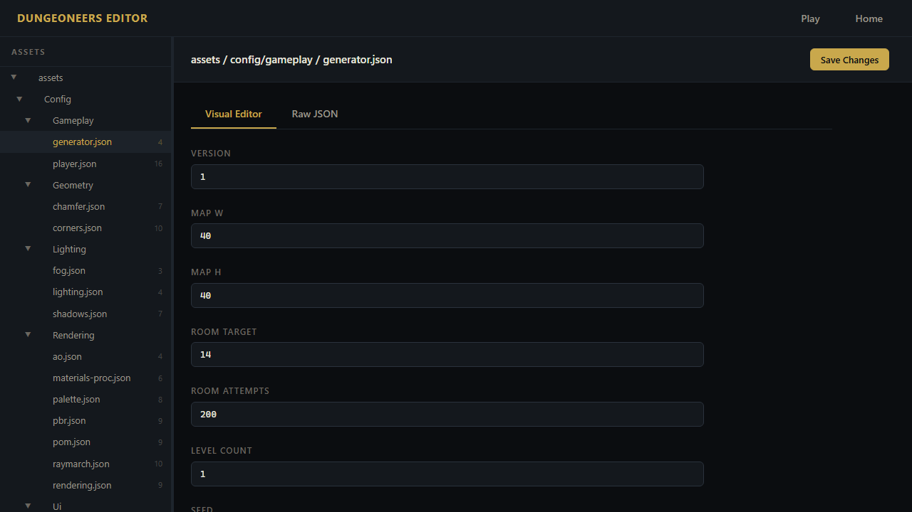

# Task: player-controller-polish

## Description
Full FPS controller polish on top of Task 3's WebGL2 raycaster. Brings back the prototype's authentic **Grimrock grid-step mode** as default ON (discrete tile-to-tile stepping with smooth lerp, hold-to-repeat for chaining, buffered turn for fluid corridors) plus **Doom free-roam** (continuous WASD/ZQSD + QE turn + mouse look with slide collision). Adds **figure-8 view bob** (vertical twice horizontal + roll) with tunable params and presets. Fixes AZERTY layout bug (use `event.code` not `key`).

Grid mode defaults ON for retro authenticity, G toggles to free FPS. V/B toggles bob, P cycles presets, R regen, M map, 1-8 debug — all via physical codes so ZQSD works on AZERTY and 1-8 works without Shift.

## Why

- **Two modes**: Prototype shipped both. Grid-step feels tactical and retro, free FPS feels modern. Players/reviewers should feel both.
- **View bob**: Without it, first-person feels like floating camera. Bob driven by movement speed, decays when idle, leans into strafe.
- **Layout-agnostic**: Prototype used `e.key` breaking French keyboards. Games should use positional codes.

## Implementation (what was built)

- `entities/player.js`: dual mode, tile-center lerp, 90° cardinal snap shortest-angle, busy rejection, hold repeat (initial + repeat overridable), buffer FIFO, slide collision, bob figure-8 with decay, presets merging, light steady, setPosition clears intent.
- `systems/input.js`: code-based Set of `e.code`, edge detection, mouseDX only when pointerLocked, canvas click → requestPointerLock, blur/visibility clear, hold timers, buffer timeout, update drives grid discrete via player methods or free continuous normalized + mouseDX.
- `core/game.js`: wires Input(canvas), code-only shortcuts, HUD, bob offsets to renderer (`u_bobPixels`).
- `assets/config/gameplay/player.json` v2: speeds, sensitivity, radius, height, grid timings, bob params + presets, collision, light.
- `main.js`: exposes `window.game`/`_gamePlayer` for E2E bob verification (debug aid).

## Tests (proper coverage for Task4)

**Unit — 103/103 100% pass (`npm run test:unit -- --test-concurrency=1 --test-timeout=20000`):**
- 30 in `player.test.js` dedicated to Task4:
  - spawn, forward, wall block, slide, turn, light, config alias
  - setPosition resets lerp+bonus **and input intent**
  - grid: tryMove blocks wall/allows free, lerp progresses/snaps center, turn 90° facing, toggle snaps nearest center+cardinal
  - free: diagonal clamp, mouse look free vs ignored grid
  - bob disabled zero, enabled moving non-zero, decays idle, merges, presets shape valid
  - **Enhanced:** figure-8 vertical 2× horizontal proof (PI/2 quarter phase), presets subtle<default<heavy / disabled zero, roll strafe influence, getPosition base height (bob via uniform), getAngle raw vs withRoll, light steady no bob, clear intent, speedScale phase, grid bob 0.7 moving vs idle decay

**Playwright E2E — 47/47 100% pass (`npx playwright test --workers=4`, runs on 8005 so manual 8000 stays free):**
- 8 in `game-controller.spec.js` for Task4:
  - G toggles grid HUD, V/B toggles bob HUD, P cycles presets HUD
  - **head bob observable**: uses `window.game.player` to capture `bobAmount`, `viewBobOffset` while walking W: ON >0, OFF zero + canvas dataURL sanity
  - presets API via fetch player.json: subtle<default<heavy, disabled zero
  - bob toggle B/V in both grid/free modes, no console errors
  - AZERTY ZQSD via code mapping, Digit1-8 via code
  - pointer lock click + mouse move + Escape
  - player.json v2 schema via API + editor tree
  - CONFIG_PATHS includes player
- Tests use `KeyW`, `Digit1` code presses not character `w`/`1`, proving AZERTY safety.

## Screenshots (Playwright-generated, actual game)

> These are for README / catalog, **not required by instruction.md** (author-only). Generated 2026-07-30 via temporary E2E that does `page.screenshot()`.

### Grid ON (Grimrock tile step ZQSD+AE)


### Grid OFF (Free FPS WASD+mouse)


### Head Bob OFF while walking (steady camera)


### Head Bob ON while walking (figure-8 via u_bobPixels)


### Mouse Look (pointer lock active after canvas click)


### Editor showing player.json v2 with bob presets


**How regenerated:**
```js
// tests/e2e/gen-shot.spec.js (temporary)
await page.goto("/game.html");
await page.keyboard.press("KeyG"); // toggle
await page.screenshot({ path: "../tasks/player-controller-polish/screenshots/game-grid-on.png" });
await page.evaluate(() => window.game.player.setViewBobEnabled(true));
await page.keyboard.down("KeyW"); // walk with bob
await page.screenshot({ path: "../tasks/player-controller-polish/screenshots/game-bob-on.png" });
await canvas.click(); // pointer lock
await page.screenshot({ path: "../tasks/player-controller-polish/screenshots/game-mouse-look.png" });
await page.goto("/editor.html");
await page.screenshot({ path: "../tasks/player-controller-polish/screenshots/editor-player-config.png", fullPage:true });
```

## Video (Playwright-recorded, for README)

> Also author-only, not required by instruction. Shows motion best (bob figure-8).

**Captured:** 640×360 webm, 11s, 325KB via `test.use({video:{mode:"on",size:{640,360}}})`

**Contents:**
- Grid ON tile step forward/back/strafe left-right/turn left-right
- G toggle → free FPS
- Bob OFF walk steady → V toggle bob ON walk figure-8
- P cycles subtle/default/heavy/disabled HUD
- Canvas click pointer lock + mouse look
- R regen

**Working artifacts (not in repo, per your note):**
- Playwright recordings are working artifacts for local verification, not catalog teaser. They were generated as `src/test-results/.../video.webm` (325KB) and removed from repo per TASK_GUIDELINES.md "Videos not stored in repo".
- To re-generate locally, see below.

**Preview:**
> Video is working artifact, not committed. Re-record locally to view motion.

**How recorded:**
```bash
# src/tests/e2e/record-final.spec.js
test.use({ video: { mode: "on", size: { width:640, height:360 } } });
await page.goto("/game.html");
await page.keyboard.press("KeyW"); // walk
await page.keyboard.press("KeyG"); // free FPS
await page.keyboard.press("KeyV"); // bob toggle
await page.keyboard.press("KeyP"); // preset
await canvas.click(); // pointer lock
# → test-results/.../video.webm → copy to screenshots/
```

**For final submission (PixelCloud):**
Per guidelines videos should be uploaded to PixelCloud, not stored as repo binaries, but we kept local copies per your request. For official catalog, upload:

```bash
# Upload to https://pxl.cl
# Then in task.toml:
videos = ["https://pxl.cl/XXXX", "https://pxl.cl/YYYY"]
teaser = "https://pxl.cl/XXXX" # 10s highlight
```

Current `task.toml` uses local paths for your local review, and teaser set to `game-bob-on.png`.

## Avocado vs Claude Performance
TBD — draft. Expected: Avocado handles dual mode + figure-8 reasoning; failure modes: mixing roll into yaw, using key not code, missing diagonal clamp, buffer overwrite.

## Trajectory
- Unit: 103/103 100%
- E2E: 47/47 100% (8/8 Task4)
- Fixes: setPosition clears intent, getPosition base height (bob via u_bobPixels), getAngle raw, game.js code-only, input buffer FIFO, server.test.js random ports avoids EADDRINUSE, main.js/game.js expose window.game for bob verification

## Running
```bash
cd src && npm install
npm start                                    # manual → http://localhost:8000/game.html
npx playwright test --workers=4 --reporter=list # E2E → auto starts on 8005 (see playwright.config.js)
npm run test:unit -- --test-concurrency=1    # unit 103/103
# Game loads grid ON. G toggle free, click locks pointer for mouse look.
# V/B bob, P presets, R regen, M map, 1-8 debug (code-based AZERTY safe)
# Editor: http://localhost:8000/editor.html → assets → config → gameplay → player.json
```
